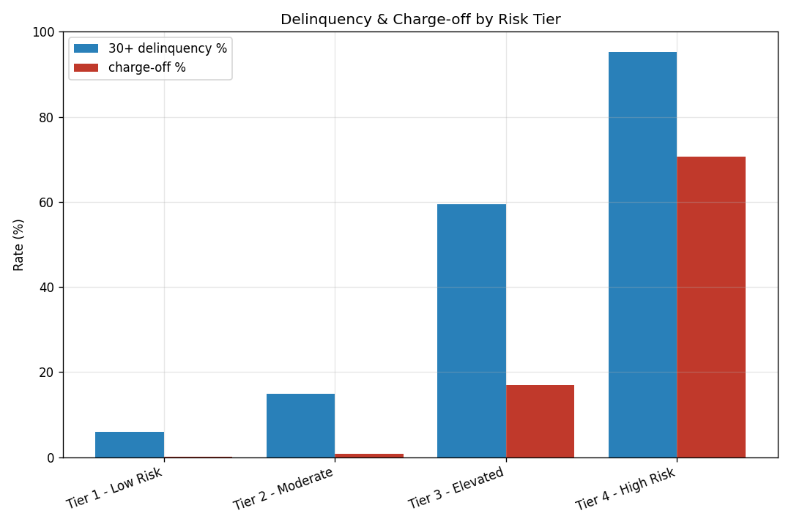

# Credit Card Portfolio Performance & Delinquency Analytics

An end-to-end analytics project that measures **portfolio performance, delinquency,
and charge-off risk** for a consumer credit-card book, segments cardholders by
risk, isolates the drivers of rising delinquency, and delivers a cost-benefit
recommendation for credit-line policy.

It builds a relational **PostgreSQL** database, cleans and validates raw
card-system exports in **Python**, computes KPIs with **SQL** (CTEs, window
functions, conditional aggregation), adds **scikit-learn** risk segmentation and a
delinquency-driver model, and presents an interactive **Tableau** dashboard with
an executive summary of recommendations.

> **Stack:** SQL · PostgreSQL · Python (pandas / NumPy / scikit-learn / matplotlib) · Tableau · Excel

---

## Why this project

Portfolio delinquency was rising and leadership needed to know **why**, **who is
driving it**, and **what to do** without choking off healthy growth. This project
answers all three from one data model. The headline result is a realistic one:
**risk is highly concentrated.** The two highest-risk tiers are just **6.9% of
accounts** but carry **78% of all charged-off balance** — and the single strongest
driver of delinquency is **credit utilization** (odds ratio 3.4× per standard
deviation), with **thin-file** accounts defaulting at roughly twice the rate of
established files.

## Architecture

```
 raw card-system exports        cleaning & validation         analysis-ready data
 (messy CSV exports)     ──▶    python/clean_validate.py ──▶  data/processed/*.csv
                                                                    │
                              ┌─────────────────────────────────────┼───────────────┐
                              ▼                                     ▼               ▼
                   PostgreSQL (sql/)                    Python analytics      BI dashboard
                   schema + CTE/window queries          (KPIs, segmentation,  (Tableau / Power BI
                                                         drivers, charts)       from extracts)
```

All three analysis layers (SQL, Python, BI) use the **same metric definitions**,
so they report identical numbers and cross-check each other.

## Repository layout

| Path | Contents |
| --- | --- |
| [`python/`](python) | `generate_raw_data.py` (synthetic portfolio), `clean_validate.py` (cleaning + validation), `analytics.py` (KPIs, segmentation, drivers, extracts, charts) |
| [`sql/`](sql) | `01_schema.sql`, `02_load.sql`, and analysis scripts `03`–`06` |
| [`data/raw/`](data/raw) | Intentionally messy source exports |
| [`data/processed/`](data/processed) | Cleaned, validated, analysis-ready tables |
| [`dashboard/`](dashboard) | BI extracts, chart renders, and the dashboard build guide |
| [`reports/`](reports) | Executive summary, headline findings, KPI JSON, data-quality report |
| [`docs/`](docs) | Data dictionary and metric definitions |

## The data model

Five related tables — reference data (`regions`, `card_products`), the customer
and account dimensions (`cardholders`, `accounts`), and the transactional monthly
statement panel (`monthly_statements`, ~50K accounts × 12 cycles). Full schema in
[`sql/01_schema.sql`](sql/01_schema.sql); column-level docs in
[`docs/data_dictionary.md`](docs/data_dictionary.md).

## Analyses performed

- Delinquency rate (30 / 60 / 90+ DPD), credit utilization, and charge-off rate
- Delinquency-bucket aging distribution and **roll-rate / cure-rate** transitions
- **Cardholder risk segmentation** — a rule-based risk tier plus an unsupervised
  **KMeans** segmentation (scikit-learn)
- **Root-cause analysis** decomposing delinquency by utilization band and credit-
  file depth, with their interaction
- **Logistic-regression driver model** quantifying each factor as an odds ratio
- **Vintage** and monthly **trend** analysis of the rising delinquency
- A **cost-benefit recommendation** for tightening credit-line increases

SQL techniques on display: multi-CTE pipelines, window functions (`ROW_NUMBER`,
`NTILE`, `LAG`, `LEAD`), `FILTER` conditional aggregation, `GROUPING SETS`, and a
reusable risk-profile **view**.

## Selected results

*(computed by `python/analytics.py`; see [`reports/findings.md`](reports/findings.md))*

| KPI | Value |
| --- | --- |
| Accounts / outstanding balance | 50,000 / $298.9M |
| 30+ day delinquency rate | 15.37% |
| Charge-off rate | 2.74% |
| Average utilization | 28.5% |
| Delinquency trend over the window | 7.58% → 13.32% |
| High-risk tiers' share of charge-off balance | 78.2% |
| Top delinquency driver (odds ratio / +1 SD) | Utilization (3.4×) |



**Recommendation:** tighten credit-line increases (CLI) for the high-risk segment
(Tiers 3–4) while continuing them for low-risk tiers. On the data, this projects a
**~15% reduction in charge-off exposure** while **preserving 90%+ of low-risk
portfolio growth** (low-risk tiers hold 94.3% of performing balance). Full
reasoning in [`reports/executive_summary.md`](reports/executive_summary.md).

## How to run

### 1. Python pipeline (no database required)
```bash
pip install -r requirements.txt
python python/generate_raw_data.py     # writes data/raw/
python python/clean_validate.py        # writes data/processed/ + data-quality report
python python/analytics.py             # writes dashboard extracts, charts, reports/kpis.json
```

### 2. PostgreSQL (load + query)
```bash
createdb creditcard
psql -d creditcard -f sql/01_schema.sql
psql -d creditcard -f sql/02_load.sql        # run from the repo root (relative \copy paths)
psql -d creditcard -f sql/03_portfolio_kpis.sql
psql -d creditcard -f sql/04_risk_segmentation.sql
psql -d creditcard -f sql/05_root_cause.sql
psql -d creditcard -f sql/06_trend_analysis.sql
```

> **SQL is standard PostgreSQL (13+).** Its results were validated against the
> Python KPIs via an automated cross-check — the layers report identical numbers
> (e.g. 50,000 accounts, 15.37% 30+ delinquency, 2.74% charge-off, and an
> identical risk-tier table), so the SQL and Python implementations confirm each
> other.

### 3. Dashboard
Open the extracts in `dashboard/extracts/` with Tableau or Power BI following
[`dashboard/DASHBOARD_GUIDE.md`](dashboard/DASHBOARD_GUIDE.md). Static renders are
in `dashboard/charts/`.

## Notes on the data

The source data is **synthetic**, generated with a fixed random seed so the whole
pipeline is reproducible. Each account is given a latent monthly default
propensity built from low FICO, high utilization, thin credit file, and low
income, and delinquency evolves through a monthly roll-rate process — so the KPIs,
segments, and drivers reflect real, internally-consistent patterns rather than
noise. The schema and analysis would apply unchanged to a real card-processing
extract.
